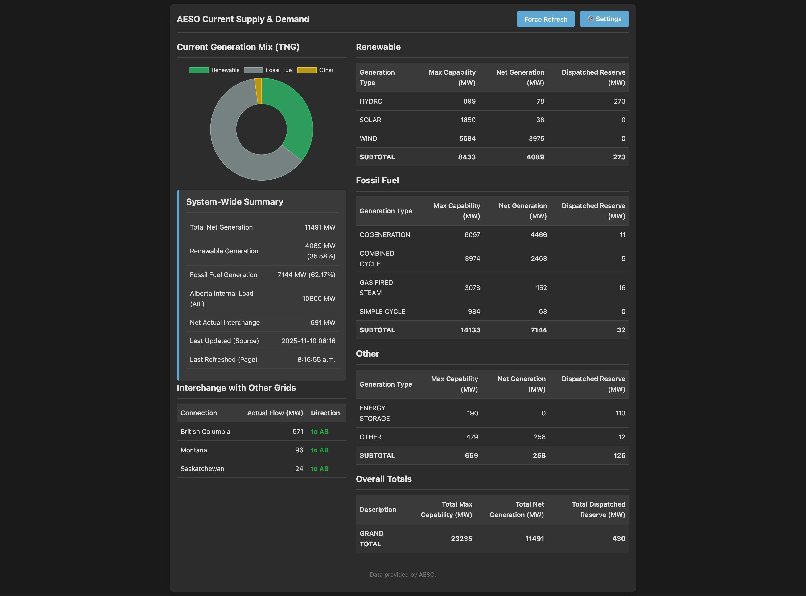

# ⚡ AESO Real-Time Electricity Dashboard

A modern, real-time web dashboard that fetches, processes, and visualizes current electricity supply and demand data from the Alberta Electric System Operator (AESO) public API.



## ✨ Features

- **Real-Time Data:** Fetches the latest generation and grid status from AESO's API.
- **Categorized Generation:** Automatically groups generation sources into `Renewable`, `Fossil Fuel`, and `Other` categories.
- **Interactive Chart:** A doughnut chart visualizes the current generation mix (Total Net Generation).
- **Detailed Tables:** Breaks down generation by fuel type, showing Maximum Capability, Net Generation, and Dispatched Reserve.
- **System Summary:** A quick overview of key metrics like Total Net Generation, Alberta Internal Load (AIL), and Net Interchange.
- **Auto-Refresh:** The dashboard data automatically updates, with a configurable interval.
- **User Settings:**
    - Toggle auto-refresh on/off.
    - Set a custom refresh interval.
    - Switch between light and dark modes.
    - Settings are saved in your browser's local storage.
- **JSON API:** Provides a clean JSON endpoint at `/api/data` for programmatic access to the processed data.
- **Containerized:** Ready to run with Docker and Docker Compose for easy deployment.

## 🛠️ Tech Stack

- **Backend:** Python, Flask, Gunicorn
- **Frontend:** HTML, CSS, Vanilla JavaScript
- **Data Visualization:** Chart.js
- **Containerization:** Docker

## 🚀 Getting Started

There are two ways to run this project: using Docker (recommended for ease of use) or setting up a local Python environment.

### Prerequisites

- **AESO API Key:** You must have an API key from AESO. You can register for one on the AESO API Portal.
- **Docker & Docker Compose:** (Recommended) Install Docker and Docker Compose.
- **Python 3:** (For local setup) Python 3.8+ is recommended.

### 1. Clone the Repository

```bash
git clone <your-repository-url>
cd aeso-scrape
```

### 2. Add Your API Key

Create a file named `api.key` in the root of the project directory and paste your AESO API key into it. The file should contain only the key itself.

```bash
# Create the file
echo "YOUR_API_KEY_HERE" > api.key
```

> **Important:** The `api.key` file is listed in `.gitignore` to prevent you from accidentally committing your secret key to version control.

### 3. Running the Application

#### Option A: With Docker (Recommended)

With Docker and Docker Compose installed, running the application is a single command:

```bash
# Build and run the container in detached mode
docker-compose up --build -d
```

The dashboard will now be available at http://localhost:2376.

To stop the application:
```bash
docker-compose down
```

#### Option B: Local Python Environment

If you prefer not to use Docker, you can run the app directly with Python.

```bash
# 1. Create and activate a virtual environment
python3 -m venv .venv
source .venv/bin/activate

# 2. Install the required packages
pip install -r requirements.txt

# 3. Run the Flask application
flask run --host=0.0.0.0 --port=2376
```

The dashboard will be available at http://localhost:2376.

## 🔌 API Endpoint

The application provides a simple JSON API endpoint to access the processed data. This can be used for other applications or integrations.

**Endpoint:** `/api/data`

**Method:** `GET`

**Example Response:**

```json
{
  "categories": {
    "Fossil Fuel": [ ... ],
    "Other": [ ... ],
    "Renewable": [ ... ]
  },
  "renewable_percent": 15.78,
  "summary": {
    "alberta_internal_load": "10500",
    "total_net_generation": "11000",
    ...
  },
  "totals": {
    "mc": { "Fossil Fuel": 12000, "Other": 500, "Renewable": 3000, "Total": 15500 },
    "tng": { "Fossil Fuel": 9000, "Other": 200, "Renewable": 1800, "Total": 11000 },
    ...
  }
}
```